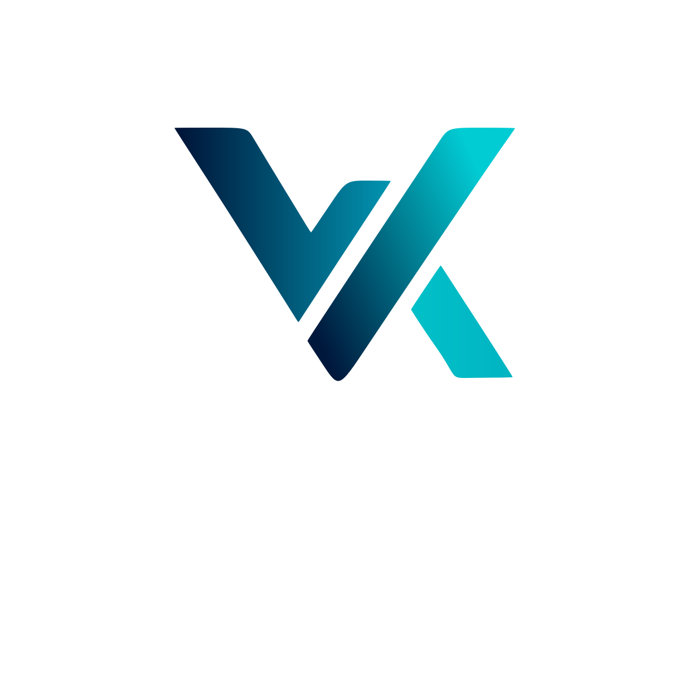

<p align="center">
  
</p>

<p align="center">
  
</p>

<p align="center">
  <strong>Self-hosted AI platform built for healthcare professionals</strong><br>
  Chat, medical imaging, agents, research, documents, notes, calendar — all running locally on your hardware.
</p>

<p align="center">
  <a href="#quick-start">Quick Start</a>&nbsp;&nbsp;|&nbsp;&nbsp;
  <a href="#features">Features</a>&nbsp;&nbsp;|&nbsp;&nbsp;
  <a href="#deployment">Deployment</a>&nbsp;&nbsp;|&nbsp;&nbsp;
  <a href="#contributing">Contributing</a>&nbsp;&nbsp;|&nbsp;&nbsp;
  <a href="ROADMAP.md">Roadmap</a>
</p>

---

## What is Vaidyx?

Vaidyx is a self-hosted AI workspace designed for medical professionals and healthcare teams. It runs entirely on your own hardware — your data never leaves your network. Connect local models like MedGemma for medical image analysis, or plug in cloud APIs. One interface for chat, research, documents, and clinical workflows.

---

## Quick Start

### Docker (Recommended)

```bash
git clone https://github.com/Nikhil-Rao20/Vaidyx.git
cd Vaidyx
docker compose up -d --build
```

Open `http://localhost:7000` once containers are healthy.

**GPU support:**
```bash
# NVIDIA
docker compose -f docker-compose.yml -f docker-compose.gpu-nvidia.yml up -d --build

# AMD
docker compose -f docker-compose.yml -f docker-compose.gpu-amd.yml up -d --build
```

### Native Install

```bash
git clone https://github.com/Nikhil-Rao20/Vaidyx.git
cd Vaidyx
pip install -r requirements.txt
python app.py
```

The app starts on port `7000`. Set `APP_BIND=0.0.0.0` to expose on your network.

---

## Features

### Medical AI & Vision

- **MedGemma Integration** — Analyze medical images (X-rays, MRIs, CT scans) with Google's MedGemma vision models via Ollama
- **Multi-modal Chat** — Send images inline with text; the model sees and interprets them directly
- **Clinical Context** — AI responses tuned for medical professionals with domain-specific reasoning

### Chat & Agents

- **Streaming Chat** — Real-time responses with session management, pinning, archiving, and incognito mode
- **40+ Agent Tools** — File operations, web search, shell execution, document editing, calendar management, and more
- **Tool Use & Planning** — Agents can plan multi-step tasks, use tools, and ask for confirmation before acting
- **Memory & Skills** — Persistent memory with semantic search; AI-authored reusable skills that improve over time
- **Teacher Escalation** — Local model stuck? Auto-escalates to a stronger model, learns a skill from the result
- **MCP Support** — Model Context Protocol server integration for extensible tool access

### Model Cookbook

- **Hardware-Aware Recommendations** — Scans your GPU/VRAM/RAM and tells you exactly what fits
- **One-Click Serve** — Download and serve models from HuggingFace with optimized presets
- **GGUF Browser** — Browse quantized model variants with size and quality tradeoffs
- **Multi-Provider** — Ollama, vLLM, SGLang, llama.cpp, LM Studio, MLX (Apple Silicon)

### Deep Research

- **Autonomous Research** — Multi-step web research with source reading and synthesis
- **Multiple Search Backends** — SearXNG, Brave, DuckDuckGo, Google PSE, Tavily, Serper
- **Visual Reports** — Clean HTML reports with citations and source links

### Documents & Writing

- **AI-Powered Editor** — Create, edit, and refine documents with AI suggestions
- **Format Support** — Markdown, HTML, CSV, syntax-highlighted code, PDF form-filling
- **Version History** — Track document changes over time
- **Personal RAG** — Vector-indexed document search across your uploaded files

### Notes, Tasks & Calendar

- **Notes** — Google Keep-style notes with AI integration
- **Scheduled Tasks** — One-time, daily, weekly, or cron-based automation with timezone support
- **Webhook Tasks** — Trigger agent tasks via authenticated webhooks
- **CalDAV Sync** — Sync with Radicale, Nextcloud, Apple Calendar, Fastmail

### Image Generation & Gallery

- **Multiple Backends** — GPT-Image, DALL-E, Flux, Stable Diffusion/SDXL, HiDream, Krea
- **Local Generation** — Run diffusion models on your own GPU
- **Built-in Gallery** — Browse, organize, and edit generated images

### Voice

- **Text-to-Speech** — Configurable TTS with provider selection and caching
- **Speech-to-Text** — Local Whisper (CPU/GPU) or external STT endpoints

### Compare Mode

- **Blind Testing** — Side-by-side model comparison with blinded responses
- **Synthesis** — Merge the best parts of multiple model outputs

### Security & Multi-User

- **Multi-User Auth** — Bcrypt passwords, session tokens, TOTP 2FA with backup codes
- **Role-Based Access** — Admin and user privilege levels with granular permissions
- **CSP & Security Headers** — Nonce-based Content Security Policy, X-Frame-Options, and more
- **Prompt Injection Protection** — Untrusted content is wrapped and sandboxed
- **Self-Hosted** — Your data stays on your hardware. No external telemetry.

### UI & Customization

- **16+ Built-in Themes** — Dark-first design with a full custom theme creator
- **Adjustable Text Size** — Global font size slider from 85% to 150%
- **Responsive Layout** — Resizable sidebar, density settings, keyboard shortcuts
- **No Build Step** — Vanilla JS ES modules; just serve and go

---

## Supported Providers

| Type | Providers |
|------|-----------|
| **Cloud APIs** | OpenAI, Anthropic, Google Gemini, Groq, DeepSeek, OpenRouter, xAI, Mistral, Together, Fireworks, Cerebras, SambaNova |
| **Local Serving** | Ollama, vLLM, SGLang, llama.cpp, LM Studio, MLX |
| **Image Gen** | GPT-Image, DALL-E, Flux, Stable Diffusion/SDXL, HiDream, Krea |
| **Search** | SearXNG, Brave, DuckDuckGo, Google PSE, Tavily, Serper |
| **Calendar** | CalDAV (Radicale, Nextcloud, Apple, Fastmail) |

---

## Tech Stack

- **Backend** — Python, FastAPI, SQLAlchemy (SQLite), ChromaDB, fastembed
- **Frontend** — Vanilla JavaScript ES modules (zero build step)
- **AI** — Any OpenAI-compatible API, Ollama for local models
- **Search** — SearXNG (self-hosted, default)
- **Containers** — Docker Compose with optional GPU overlays

---

## Deployment

| Method | Notes |
|--------|-------|
| **Docker Compose** | Vaidyx + ChromaDB + SearXNG + ntfy. GPU overlays for NVIDIA and AMD. |
| **Native Python** | `pip install -r requirements.txt && python app.py` (Python 3.11+) |
| **macOS** | `start-macos.sh` or build a standalone `.app` with `build-macos-app.sh` |
| **Windows** | PowerShell launcher (`launch-windows.ps1`) or portable build |
| **Linux systemd** | Install as a service with `install-service.sh` |

See the [setup guide](docs/setup.md) for HTTPS, reverse proxy, and advanced configuration.

---

## Contributing

Contributions are welcome. Good starting points:

- Fresh-install testing on different hardware
- Provider setup and integration bugs
- UI polish and accessibility improvements
- Documentation and guides

See [CONTRIBUTING.md](CONTRIBUTING.md) and [ROADMAP.md](ROADMAP.md) for details.

---

## Security

Vaidyx is designed to run on your own infrastructure. Keep auth enabled, keep sensitive data out of Git, and never expose raw model ports publicly. See [SECURITY.md](SECURITY.md) and [THREAT_MODEL.md](THREAT_MODEL.md) for the full security posture.

---

## License

AGPL-3.0-or-later — see [LICENSE](LICENSE) and [ACKNOWLEDGMENTS.md](ACKNOWLEDGMENTS.md).
